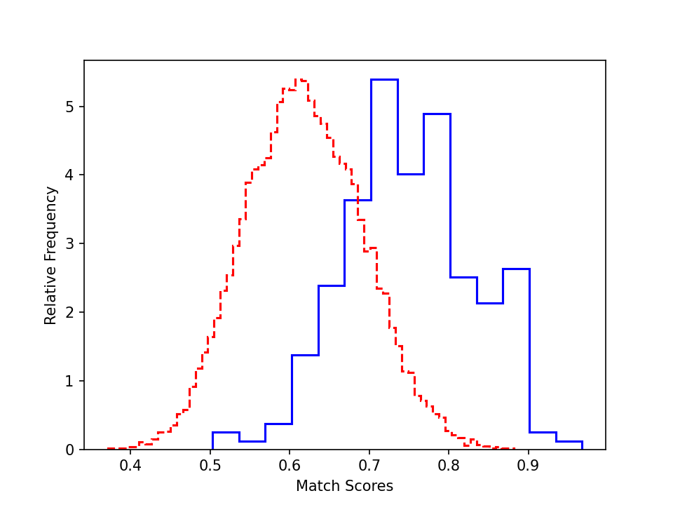

# Occluded Face Recognition

### Overview

In this project, we focus on face recognition on occluded facial images. Occluded facial images are those faces where 
parts of them are covered, for example, images of people wearning sunglasses or masks. Our approach is to first train a 
face recognition model using convolutional neural networks (CNN) on normal (non-occluded) facial data. Then, we report 
results of this trained model on occluded test sets. We can anticipate that the results on occluded test sets are much 
worse than the normal validation set. To address this issue, we propose to generate synthetic "occluded" data by identifying 
and masking the eye areas and mouth areas of the original facial images. Then, the synthetic images are used as additional data 
to perform data augmentation. We expect the test accuracy on occluded test data be much better after training on the augmented data.

### Data

- Dataset: **VGGFace2** (normal facial image dataset), **ROF** (occluded facial image dataset)
- [VGGFace2](https://github.com/ox-vgg/vgg_face2): 116 subjects
  - Train set: 2088 images (normal)
  - Validation set: 232 images (normal)
- [ROF](https://github.com/ekremerakin/RealWorldOccludedFaces): 182 subjects
  - Train set: 2746 images (normal)
  - Augmented train set: 8238 images (normal + synthetic occlusion)
  - Validation set: 688 images (normal)
  - Test set 1: 192 images (occlusion: people wearing masks)
  - Test set 2: 564 images (occlusion: people wearning sunglasses)

We use the occluded images as test set because we believe that they are sufficient to test the generalization ability of 
our model. This is due to the noise signals brought by face occlusion (masks, sunglasses), which is kind of different from 
the data distribution of the normal training and validation sets.

### Research Component

Data augmentation is an effective technique in machine learning to improve the generalization ability of models. 
Here, due to the gap between training/validation and test sets (training/validation sets do not include occluded images), 
we propose to automatically generate synthetic occluded data to remedy the absense of occluded images in training set.
To achieve this, we first identify the eye areas and nose-mouth areas which resemble the covered area of sunglasses (upper-occluded) and masks (lower-occluded),
respectively. Then, we mask (black-out) these areas in the original image to generate synthetic occluded images. Finally,
we add these synthetic images into our training set for more sufficient training of our model.

Here we present some examples of different types of images we used in our datasets. The first image is a normal facial image of Elon Musk.
The second and the third ones are occluded images from ROF test sets. The fourth and fifth ones are synthetic occluded
images that we generate for data augmentation.


### Dependencies
pytorch 1.11  
tqdm  
python 3.7  
cv2  
numpy  
matplotlib 

These packages can be installed by directly running
```bash
pip3 install -r requirements.txt
``` 

Or for anaconda users, you can run
```bash
conda env create --file conda/environment.yml
```
If you are getting erro importing torchvision becuase of pillow, run
```bash
conda uninstall torchvision
conda install -c pytorch torchvision
```

### Data & model download

The processed data of ROF and VGG datasets, as well as the model checkpoints trained on these two datasets, can be downloaded from 
[Google Drive](https://drive.google.com/drive/folders/1wd9QT9SKOMEG6k62-IU91pgN7HwpMKuE?usp=sharing). Just download these zipped files
and extract them in the root directory of this project. Contents:

- ROF_data/ -- Data for ROF dataset
- vgg_face_image/ -- Data for VGGFace2 dataset
- weights_vgg/ -- Model trained on VGGFace2 dataset
- weights_rof_original/ -- Model trained on ROF dataset (without data augmentation)
- weights_rof_augmented/ -- Model trained on ROF dataset (with data augmentation)
- resnet18_weights.pth -- ResNet18 model pre-trained on ImageNet, which we use to initialize our model.

### Training & Validation
On VGGFace2:
```bash
python3 train.py -train_data vgg_split/train.txt -valid_data vgg_split/validate.txt -subject2class vgg_split/subject2class.json \
-resnet resnet18_weights.pth -save_dir weights_vgg/ -lr 0.0003 -epochs 100 -batch 128 -wait_steps 5
```
Training lasts for about one minute on a single 2080Ti. There will be warnings on libpng during training, but you can ignore them.

On ROF using original data:
```bash
python3 train.py -train_data rof_split/train.txt -valid_data rof_split/validate.txt -subject2class rof_split/subject2class.json \
-resnet resnet18_weights.pth -save_dir weights_rof_original/ -lr 0.001 -epochs 100 -batch 128 -wait_steps 5
```
Training lasts for about five minutes on a single 2080Ti.

On ROF using augmented data:
```bash
python3 train.py -train_data rof_split/train_aug.txt -valid_data rof_split/validate.txt -subject2class rof_split/subject2class.json \
-resnet resnet18_weights.pth -save_dir weights_rof_augmented/ -lr 0.001 -epochs 100 -batch 128 -wait_steps 5
```
Training lasts for about 10 minutes on a single 2080Ti.

### Testing

On test set with masks:
```bash
python3 validate.py -test_data rof_split/test_mask.txt -subject2class rof_split/subject2class.json \
-checkpoint weights_rof_augmented/best.pth -batch 128
```

On test set with sunglasses:
```bash
python3 validate.py -test_data rof_split/test_sunglass.txt -subject2class rof_split/subject2class.json \
-checkpoint weights_rof_augmented/best.pth -batch 128
```

To test the model trained on non-augmented data, just replace `weights_rof_augmented` with `weights_rof_original`

### Model

We adopted the ResNet18 network, which has 18 layers. It has a stack of convolutional layers with a fc layer at the end. 
It is a very useful architecture in the field of computer vision. We use the model pretrained on ImageNet to speed up our training.


### Experimental results

|   Models   | VGGFace2 validation | ROF validation | ROF test (masks) | ROF test (sunglasses) |
|:----------:|:-------------------:|:--------------:|:----------------:|:---------------------:|
 |  Original  |       91.38%        |     78.92%     |      36.98%      |        18.79%         |
 | Augmented  |         N/A         |     78.05%     |      46.35%      |        24.47%         |

As is seen in the table above, if the model is trained on the original training set, although it can achieve high accuracy on
normal data, it lacks generalization ability when encountering occluded test data. After the model is trained on the augmented
data, its generalization ability is improved to a large extent, while the classification accuracy on normal data is not affected.
This phenomenon is consistent with our expectation since the model has aleady seen some synthetic occluded images during 
augmented training.

To better understand the performance, we plot the authentic and impostor distribution for the validation and test sets
(cosine similarity of the feature before the fully connected layer).

- ROF validation set:


- ROF test set (masks):



- ROF test set (sunglasses):


- We can see that the authentic and impostor distribution on the validation set is OK, as we can clearly see the difference
of the authentic and impostor pairs.

- Similar trend is found on test sets. However, the distribution are less distinguishable due to their larger difficulty.

